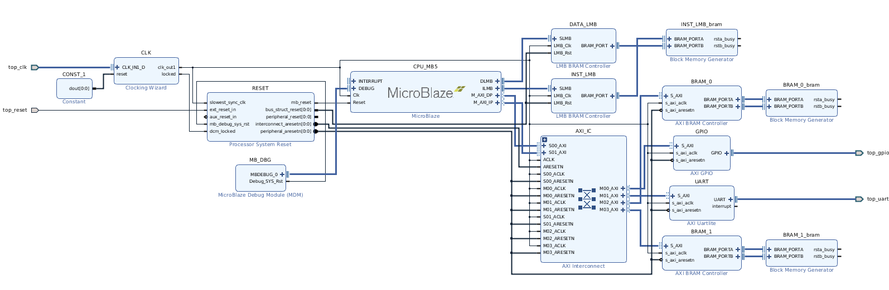

# Sakura-X Microblaze 5 Stage

*Description of the Sakura-X FPGA Microblaze 5 stage softcore target.*

---

## Getting Started

To build and run an experiment on the target using the pre-synthesised
bitfile:

```sh
$> source bin/conf.sh
$> make -B -f Makefile.experiment USB_BAUD=128000 UAS_EXPERIMENT=example/addxor UAS_TARGET=sakurax_mb5 program
```

This will build the example experiment, combine it with the pre-synthesised
bitfile and program the FPGA via the Xilinx hardware server.

## Re-creating the Vivado Project

The `vivado_sakurax_mb5.tcl` script can re-build the entire vivado project.
From the project root, run:

```sh
$> make -f Makefile.experiment UAS_TARGET=sakurax_mb5 recreate-vivado-project
```

This will (re-)create `$UAS_BUILD/vivado/sakurax_mb5/`, containing the
entire project, system block design and configuration.
See `target/sakurax_mb5/Makefile.in` to see exactly how this is done.

If you edit the system, re-implement it, then copy the output
bitfile over to `$UAS_ROOT/target/sakurax_mb5/bitstream.bit` to use
the auto-program make targets described above.

- You may also need to re-generate the memory map information file
  `target/sakurax_mb5/sakurax_mb5.mmi` to make sure that the ELF
  programs can be correctly combined with the bitfile before programming.

## Target Information

This target is an FPGA CPU Softcore: The *Microblaze* provided by Xilinx.
The *Microblaze* is a highly configurable soft CPU design, which can be
included as a managment core in larger FPGA systems.

The target FPGA platform is a SAKURA-X development board
(see links below, also known as the Sasebo-GIII),
designed for side-channel analysis.
It consists of a Xilinx Kintex-7 `xc7k160tfbg676-3` target FPGA, and a
Xilinx Spartan-6 `xc6lx45-fgg484c-3` companion FPGA.
We use only the Kintex-7 FPGA for this target, the Spartan-6 companion FPGA
is left un-programmed.

This target configures the Microblaze as follows:
- Pipeline Stages: 5
- Instruction & Data AXI Bus
- Instruction & Data Local Memory Bus
- HW Integer Divider: Enabled
- HW Multiplier: Enabled
- Barrel Shifter: Enabled
- Exception Catching / Raising
- Debug Interface Support
- Implementation Strategy: Performance Optimised
- MMU: None



The wider SoC system implemented on the FPGA consists of:
- The Microblaze CPU
  - Local memory bus access to 8K of BRAMs
  - Microblaze Debug module
- An AXI interconnect
  - AXI Access to 32K of BRAMs
  - 2 GPIO Pins
  - UART - 128000 Baud
- Processor System Reset Module
- Clock Generator Core - 25MHz

Notes:
- The LMB interfaces have no such registering.
- The AXI BRAM 0 device has 0 register stages between the CPU and the memory.
- The AXI BRAM 1 device has 1 register stage between the CPU and the memory. 
- By default, the linker script loads code and data into AXI BRAM 0.

### System Memory Map

Device      | Base          | Range    | High Address
------------|---------------|----------|----------------
UART        | 0x40600000    |  4K      | 0x40600FFF
GPIO        | 0x40000000    |  4K      | 0x40000FFF
LMB BRAM    | 0x10000000    | 16K      | 0x10003FFF
AXI BRAM 0  | 0x00000000    | 16K      | 0x00003FFF
AXI BRAM 1  | 0x00004000    | 16K      | 0x00007FFF

### Pin Locations

Pin     | SAKURA-X Pin Name     | RTL Signal Name
--------|-----------------------|-----------------------------------------------
`AC2`   | `K_CLK_OSC0_HSTL_N`   | `top_clk_clk_n`
`AB2`   | `K_CLK_OSC0_HSTL_P`   | `top_clk_clk_p`
`D19`   | `K_HEADER_0`          | `top_uart_rxd`
`N17`   | `K_HEADER_1`          | `top_uart_txd`
`N16`   | `K_HEADER_2`          | `top_gpio_tri_o[0]` (Trigger)
`G20`   | `K_LED_0`             | `top_gpio_tri_o[1]` (Debug LED)
`L19`   | `K_LED_1`             | ?
`K18`   | `K_LED_3`             | ?
`H19`   | `K_LED_4`             | ?
`L23`   | `K_PUSHSW`            | `top_reset`

---

**Useful Links:**
- [SAKURA-X FPGA Development Platform](http://satoh.cs.uec.ac.jp/SAKURA/hardware/SAKURA-X.html)
  - [Purchasing](http://www.troche.com/sakura/order.html)
- [Xilinx UG984 Microblaze Processor Reference Guide](https://www.xilinx.com/support/documentation/sw_manuals/xilinx2018_3/ug984-vivado-microblaze-ref.pdf)
- [Xilinx PG144 AXI GPIO v2.0 Product Guide](https://www.xilinx.com/support/documentation/ip_documentation/axi_gpio/v2_0/pg144-axi-gpio.pdf)
- [Xilinx PG142 AXI UART Lite v2.0 Product Guide](https://www.xilinx.com/support/documentation/ip_documentation/axi_uartlite/v2_0/pg142-axi-uartlite.pdf)
